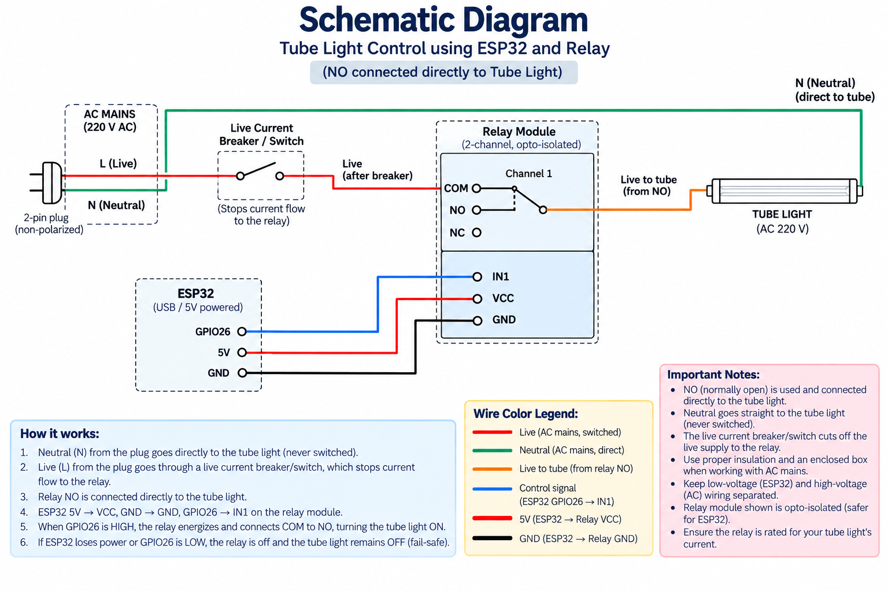

# Study Light — ESP32 Smart Relay Switch

An ESP32-based smart switch for the study room tube light. It sits between the wall switch and the light, and lets the light be turned on/off over WiFi through SinricPro (and, through SinricPro's Alexa/Google Home skill, by voice) while still leaving the physical wall switch functional.

## Overview

- **Board:** ESP32 Dev Module (esp32dev)
- **Framework:** Arduino (via PlatformIO)
- **Cloud service:** [SinricPro](https://sinric.pro) — Switch device type
- **Voice control:** Alexa / Google Home, linked through the SinricPro skill
- **Load switched:** 230V AC tube light, via a single-channel opto-isolated relay module

## How it's wired

**Live (switched):** Plug → wall switch → relay COM → relay NO → tube light.
**Neutral:** runs straight from the plug to the light, bypassing the switch and relay entirely — it is never switched.

The relay's NO (Normally Open) contact is used deliberately, not NC: if the ESP32 loses power or crashes, the relay coil de-energizes, the contact opens, and the light fails **off**, not on.

The ESP32 drives the relay across the opto-isolation barrier using three low-voltage wires:

| ESP32 pin | Relay pin |
|---|---|
| VIN (5V) | VCC |
| GND | GND |
| GPIO26 | IN |

> **Wiring note:** these three low-voltage wires must be run as a single continuous length per line, not chained jumper-to-jumper segments. Chaining jumpers adds contact resistance at every joint, which was enough in testing to keep the relay from clicking reliably and to trip the ESP32's brownout detector. If a line has to be extended, solder the joint and heat-shrink it.

### Schematic diagram


### Wiring / circuit diagram



## Relay logic (important quirk)

The raw relay hardware triggers ON when its IN pin is pulled **LOW** (confirmed by bench testing). In firmware, though:

```cpp
const bool RELAY_ON  = HIGH;
const bool RELAY_OFF = LOW;
```

These are deliberately flipped from the raw hardware behavior, because SinricPro's `onPowerState()` reported the opposite of what actually happened on the bench. Swapping the meaning of the two constants fixed the mismatch without inverting the write itself:

```cpp
digitalWrite(RELAY_PIN, state ? RELAY_ON : RELAY_OFF);
```

If you swap the relay module or re-flash from scratch, re-verify this on the bench before trusting it.

## Firmware / build setup

The project lives in `platformio.ini` at the root of this folder:

```ini
[env:esp32dev]
platform = espressif32
board = esp32dev
framework = arduino
monitor_speed = 115200
build_unflags = -std=gnu++11
build_flags = -std=gnu++17 -D ENABLE_DEBUG
lib_deps = sinricpro/SinricPro
```

- **`build_unflags`/`build_flags`:** SinricPro 5.x uses `std::variant` internally, which needs C++17. The ESP32 Arduino core defaults to `-std=gnu++11`, so it has to be explicitly overridden — without this the build fails inside the SinricPro library itself (`SettingValue`/`holds_alternative` errors), not in this project's own code.
- **`ENABLE_DEBUG`:** prints SinricPro's connection status to Serial, useful when diagnosing a WiFi/SinricPro connection issue.

### Credentials (`include/secrets.h`)

This file is **gitignored** and never committed. Copy `include/secrets.example.h` to `include/secrets.h` and fill in your own values:

```cpp
#define WIFI_SSID   "your-wifi-name"
#define WIFI_PASS   "your-wifi-password"
#define APP_KEY     "..."   // SinricPro portal > Credentials
#define APP_SECRET  "..."   // SinricPro portal > Credentials
#define SWITCH_ID   "..."   // SinricPro portal > your Switch device
```

Get `APP_KEY` / `APP_SECRET` / `SWITCH_ID` from the [SinricPro portal](https://portal.sinric.pro) after creating a device of type **Switch**.

### Build, upload, monitor (VS Code + PlatformIO)

1. Open this folder in VS Code (with the PlatformIO extension installed — see the separate PlatformIO setup README).
2. Click the checkmark (✓) in the bottom status bar to build.
3. Plug in the ESP32 via a data-capable USB cable, then click the right-arrow (→) to upload.
4. Click the plug icon to open the Serial Monitor and watch it connect to WiFi and SinricPro.

## Hardware

- ESP32 Dev Module
- 1-channel opto-isolated relay module (5V/3.3V logic side)
- Tube light fixture + existing wall switch wiring
- USB cable (data-capable) + wall USB power adapter (not a laptop port — see Troubleshooting)

## Safety notes

- The relay's mains-side (COM/NO/NC) screw terminals carry 230V. Keep them insulated and inside an enclosure — do not leave them exposed.
- Power the ESP32 from a wall USB adapter, not a laptop USB port, once installed permanently.
- Double check Live vs. Neutral at the plug before wiring in a non-polarized plug — orientation isn't guaranteed.

## Troubleshooting

**Brownout detector triggered / random resets:** usually a power problem, not a code problem. Check that the relay isn't drawing current through a long/thin/chained wiring run back to the ESP32, that the ESP32 has a proper 5V/1A+ power source, and consider a 470–1000µF capacitor across 3.3V/GND if it persists.

**Relay doesn't click but Serial prints "Study Light turned ON/OFF":** it's a hardware/wiring issue downstream of the code. Bypass the ESP32 and touch the relay's IN pin directly to 3.3V then GND to confirm the relay itself is fine, then check continuity on each of the VCC/GND/IN wires.

**Nothing prints when toggling from the app:** the command isn't reaching the firmware — check WiFi/SinricPro connectivity (enable `ENABLE_DEBUG` and watch Serial) rather than the relay wiring.

**Upload fails with "Please specify upload_port" or "Looking for upload port... Error":** see the PlatformIO setup README's upload troubleshooting section.
